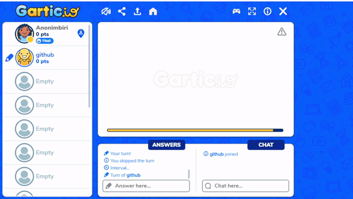
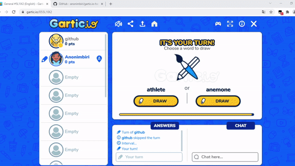

# gartic io drawing bot, answer assistant and many more features    

## Here are some images

Press <kbd>CTRL</kbd>**+**<kbd>M</kbd> to open the menu.
## Features

- **Drawing Bot**
- **Hint Assistant**
- **Anti Afk**
- **Auto Kick**
- **Rainbow Drawing**
- **Drawing Reporter**
- **Username Copy**

-----------------------
# Releases
| Gartic.io Mod Menu| Cheat Version | Github | Greasyfork |
|----------------------------|-------------|-----------------|-----------------|
| 2022 | v1.0 | [Download](	https://github.com/anonimbiri/gartic.io-hack/raw/main/script/gartic.io%20mod%20menu.user.js) | [Download](https://greasyfork.org/scripts/429227-gartic-io-mod-menu) | 
| 2021 | v0.9 | [Download](	https://github.com/anonimbiri/gartic.io-hack/raw/main/script/other_versions/gartic.io%20mod%20menu%20v0.9.user.js) | [Download](https://greasyfork.org/tr/scripts/429227-gartic-io-mod-menu?version=1000886) |
| 2021 | v0.8 | [Download](	https://github.com/anonimbiri/gartic.io-hack/raw/main/script/other_versions/gartic.io%20mod%20menu%20v0.8.user.js) | [Download](https://greasyfork.org/scripts/429227-gartic-io-mod-menu?version=992769) |
| 2021 | v0.7 | [Download](	https://github.com/anonimbiri/gartic.io-hack/raw/main/script/other_versions/gartic.io%20mod%20menu%20v0.7.user.js) | [Download]( https://greasyfork.org/scripts/429227-gartic-io-mod-menu?version=992526) |
| 2021 | v0.6 | [Download](	https://github.com/anonimbiri/gartic.io-hack/raw/main/script/other_versions/gartic.io%20mod%20menu%20v0.6.user.js) | [Download](https://greasyfork.org/scripts/429227-gartic-io-mod-menu?version=975745) |
| 2021 | v0.5 | Download | [Download](https://greasyfork.org/scripts/429227-gartic-io-mod-menu?version=975548) |
| 2021 | v0.4 | Download | [Download](https://greasyfork.org/scripts/429227-gartic-io-mod-menu?version=969051) |
| 2021 | v0.3 | Download | [Download](https://greasyfork.org/scripts/429227-gartic-io-mod-menu?version=955577) |
| 2021 | v0.2 | Download | [Download](https://greasyfork.org/scripts/429227-gartic-io-mod-menu/?version=949820) |
| 2021 | v0.1 | Download | [Download](https://greasyfork.org/scripts/429227-gartic-io-mod-menu?version=949447) |

  
 Changelog 

  

    
 v1.0 

  <ul> <li>Added a drawing bot (beta)</li> </ul>
    <ul> <li>some bug fixes</li> </ul>
     <ul> <li>a few auxiliary tools</li> </ul>
      

 v0.9 

  <ul> <li>Added word fix and word list refresh button above the word list</li> </ul>
    
    <ul> <li>Removed unnecessary codes for code</li> </ul>
      

 
 v0.8 

  <ul> <li> fixed foreign character problem (Arabic, Turkish, Azerbaijani) some words could not be detected in some languages fixed </li> </ul>
      

   

    
 v0.7 

  <ul> <li> added words for arabic (thank you to the friend who helped)  </li> </ul>
 <ul> <li> now the words will be pulled from github  </li> </ul>
 <ul> <li>custom word feature has been brought, you can add the words you want  </li> </ul>
 <ul> <li>note: you can send your words to us </li> </ul>
      

   

     
 v0.6 

  <ul> <li> There was a problem with booting fixed </li> </ul>
      

   

    
 v0.5 

  <ul> <li> Auto Answer </li> </ul>
    <ul> <li> menu interface language feature </li> </ul>
     <ul> <li> menu interface fix </li> </ul>
      <ul> <li> I added a small button for mobile, but it has not been tried, it may work stable </li> </ul>
      

   

     
 v0.4 

  <ul> <li> azerbaijan language (no full words added yet) </li> </ul>
    <ul> <li> Fixed the issue of not being able to enter the room when changing rooms </li> </ul>
     <ul> <li> important note: I will work on the problem that the buttons do not appear on mobile, I will fix it soon </li> </ul>
      

   

  
 v0.3 

  <ul> <li> Fixed page refresh issue when opening </li> </ul>
    <ul> <li> image is not full size now it will be full size and right in the middle (drawing area) </li> </ul>
     <ul> <li> New words have been added for the Turkish language, continuing to be added </li> </ul>
      

   

  
 v0.2 

  <ul> <li> if you click the button it will be red </li> </ul>
    
    <ul> <li> if you type that word it will be green </li> </ul>
    
      

    

-----------------------
# Installation
## Requirements 
| Tampermonkey  | [Download](https://www.tampermonkey.net) |
| ----------- | ------- |

## Installation Guide
**it's pretty simple to install**\
\
**Press the `download` button that appears on the screen.**\
\
**Congratulations, you downloaded**

    

-----------------------
## Disclaimer 
This project is for Educational Use only. We do not condone this software being used to gain an advantage against other people.
