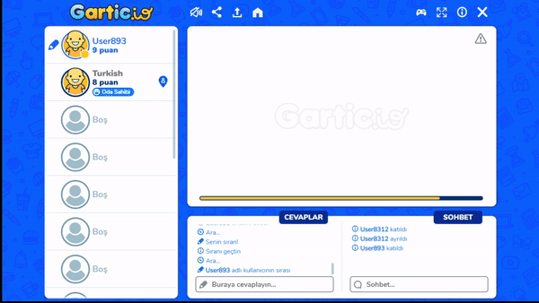

# gartic io drawing assistant, answer assistant and many more features

## Here are some images

## Features

- **Drawing Assistant**
- **Hint Assistant**
- **Anti Afk**
- **Auto Kick**
- **Rainbow Drawing**
- **Drawing Reporter**
- **Username Copy**

-----------------------
# Releases
| Gartic.io Mod Menu| Cheat Version | Github | Greasyfork |
|----------------------------|-------------|-----------------|-----------------|
| 2021 | v0.2 | [Download](./script/gartic.io%20mod%20menu.js) | [Download](https://greasyfork.org/tr/scripts/429227-gartic-io-mod-menu) |
| 2021 | v0.1 | Download | [Download](https://greasyfork.org/tr/scripts/429227-gartic-io-mod-menu?version=949447) |

  
 Changelog 

  

  
 v0.2 

  <ul> <li> if you click the button it will be red </li> </ul>
    
    <ul> <li> if you type that word it will be green </li> </ul>
    
      

    

-----------------------
# Installation
## Requirements 
- tampermonkey [Download](https://www.tampermonkey.net "click to download")

## Installation Guide (Github)
**1. first download the file to your `desktop`.**\
\
**2. Go to ` extensions` and press add a new script.**\
\
**3. Save and enter the game.**
